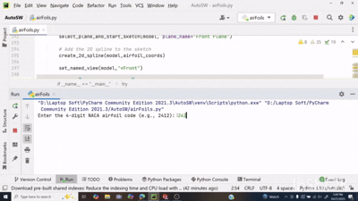

# NACA-Airfoil-Generator
#  NACA Airfoil Generator – Python + SolidWorks API

### Generate and Sketch NACA 4-Digit Airfoils Automatically in SolidWorks

---

##  Overview

**NACA Airfoil Generator** is a Python automation tool that takes a **NACA 4-digit code** (like `2412`, `0012`, etc.) and automatically:

* Generates airfoil coordinates mathematically
* Launches **SolidWorks**
* Draws the **airfoil spline** on the **Front Plane** automatically using the SolidWorks API

This tool bridges **aerodynamic theory** with **CAD automation**, helping engineers, researchers, and students rapidly model airfoils for simulation, design, or manufacturing.

---

## 🚀 Features

✅ Input any **NACA 4-digit code** (e.g. `2412`, `0015`, `4415`)
✅ Generates precise airfoil geometry using NACA equations
✅ Auto-launches **SolidWorks** and sketches the airfoil spline
✅ Adjustable chord length, point density, and unit scale
✅ Fully written in Python — no manual clicking required

---

## ⚙️ How It Works

1. You provide a NACA code (e.g. `2412`)
2. Python calculates:

   * Camber line
   * Thickness distribution
   * Upper & lower surface points
3. Coordinates are passed to SolidWorks using the COM API
4. SolidWorks automatically:

   * Opens a new part
   * Starts a sketch on the Front Plane
   * Draws a spline through the airfoil points
   * Extrude solid body for simulation

---

## 🧮 NACA 4-Digit Format

| Code   | Meaning              | Description                              |
| ------ | -------------------- | ---------------------------------------- |
| **M**  | 1st digit × 1%       | Maximum camber                           |
| **P**  | 2nd digit × 10%      | Position of maximum camber (along chord) |
| **TT** | Last two digits × 1% | Maximum thickness                        |

**Example:**
`NACA 2412` → 2% camber at 40% chord, 12% thick

---

## 🧰 Requirements

| Component          | Version                       |
| ------------------ | ----------------------------- |
| **Python**         | 3.8+                          |
| **SolidWorks**     | Any version (tested on 2021+) |
| **pywin32**        | `pip install pywin32`         |
| **math, sys**      | Built-in                      |

---
## 🖼️ Example Output

 

---

## ⚙️ Script Overview

Main functions:

```python
naca4_coords(code, n_points, chord)
create_spline_in_solidworks(coords)
```

* `naca4_coords()` → Generates upper/lower surface points
* `create_spline_in_solidworks()` → Draws the airfoil in SolidWorks

---

## 🧭 Future Improvements

* [ ] Add **5-digit** and **6-series** NACA support
* [ ] Support `.dat` airfoil files from UIUC/AirfoilTools
* [ ] Integrate with **ANSYS Fluent / SolidWorks Flow Simulation**
* [ ] Auto-export **.STL** / **.STEP** files
* [ ] GUI with Tkinter or PyQt

---

## 👨‍💻 Author

**Arafat Hossain**
🎓 Mechanical Engineering Student | Python + CAD Automation Enthusiast
🔗 GitHub: [@your-username](https://github.com/Arafat178)

---

## 📜 License

This project is licensed under the **MIT License** — free to use, modify, and distribute with credit.

---

## 💬 Acknowledgments

* NASA NACA Technical Reports
* UIUC Airfoil Database
* SolidWorks API Documentation

---
